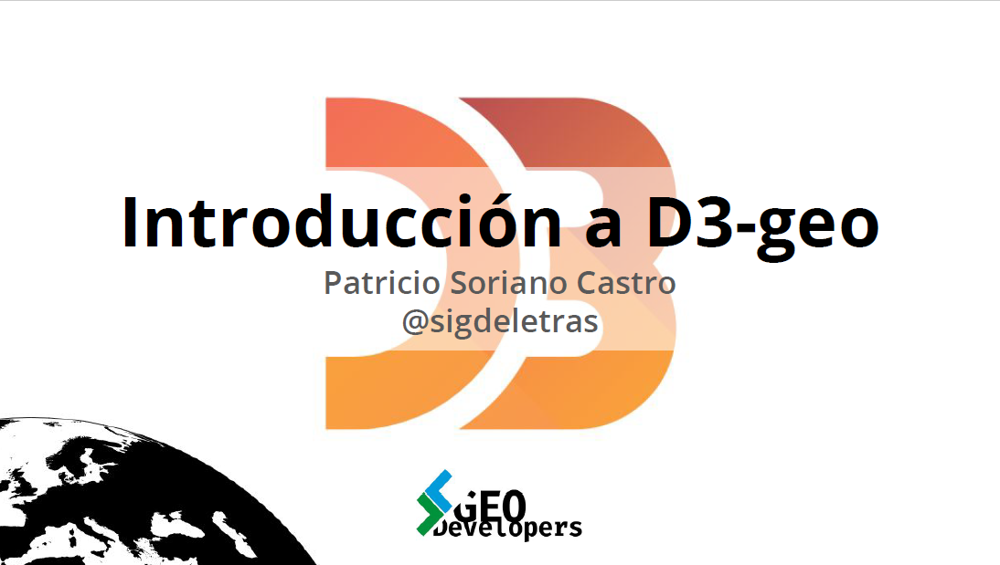

# d3-geom-geodevelopers

Materiales de la charla ["Introducción a D3-geom"](https://www.meetup.com/es-ES/geodevelopers/events/277702735/) en la comunidad [GeoDevelopers](https://www.geodevelopers.org/) el 5 de mayo del 2021.



Entrada SIGdeletras.com [Charla Introducción a D3-geom en GeoDevelopers](http://sigdeletras.com/2021/charla-introduccion-d3-geo-en-geodevelopers/)

## Vídeo de la charla

[](http://www.youtube.com/watch?v=XrLQIV9dRiY "")

## Instalación

La estrucura del proyectos está creada con la aplicación ["Create App"](https://createapp.dev/) usando Parcel como empaquetador.

Requiere tener instalado Node y el gestor de paquetes NPM.

- Clonar o descargar el repositorio.
- Entrar en la carpeta */d3-geom-geodevelopers*
- Instalar módulos con npm o yarm
```
npm install
```
- Iniciar la aplicación en modo desarrollo
```
npm start
```
- Acceder a [http://localhost:1234](http://localhost:1234)
## Recursos

- [D3js.org](https://d3js.org/)
- [Proyecciones](https://bl.ocks.org/d3indepth/f7ece0ab9a3df06a8cecd2c0e33e54ef)
- [Escalas](https://www.d3indepth.com/scales/)
- [Escalas cromáticas](https://github.com/d3/d3-scale-chromatic)
- [d3-legend](https://d3-legend.susielu.com/)
- [Desarrollo web de visor de mapas con la librería D3](http://sigdeletras.com/2021/desarrollo-web-de-visor-de-mapas-con-la-libreria-d3/)
- [Mapa de coropletas con D3](http://sigdeletras.com/2021/mapa-de-coropletas-con-d3/)
